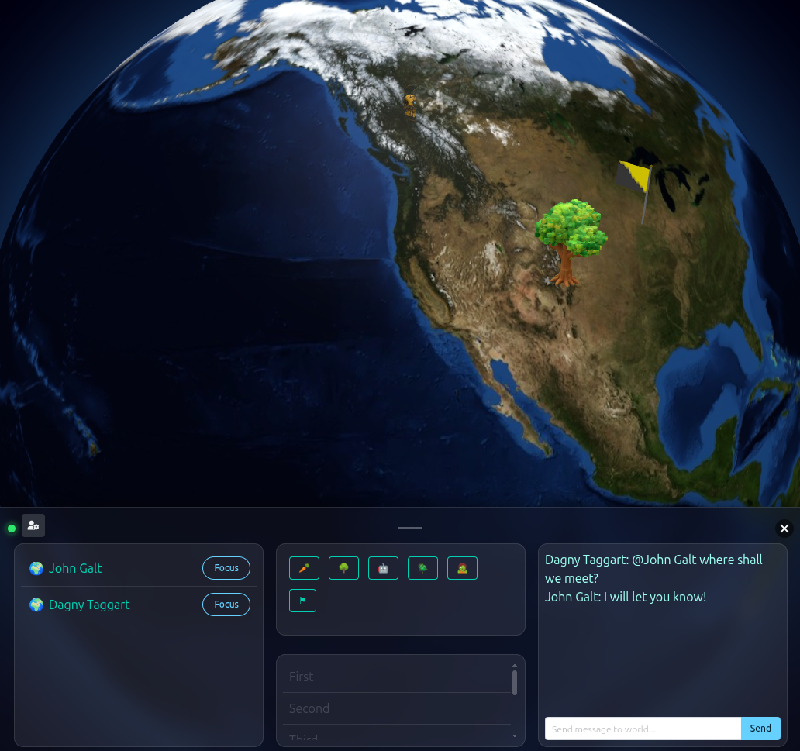

# Globo - 3D interactive world map



> _This project is in early development. More information to come_

## Examples

To try the globo library out, run the server:
```bash
bb server --example static
```
And open http://localhost:3000

## Development

From the repo root, use the root `:globo` shadow-cljs build for UI work:

```bash
npx shadow-cljs watch globo     # compile UI on change
npx shadow-cljs release globo   # production build
```

See `PROJECT_SUMMARY.md` for the full architecture, message protocol, and workflow.

## Testing

```bash
clojure -M:test                  # Clojure server tests
npx shadow-cljs compile test     # ClojureScript (node-test) tests
```
